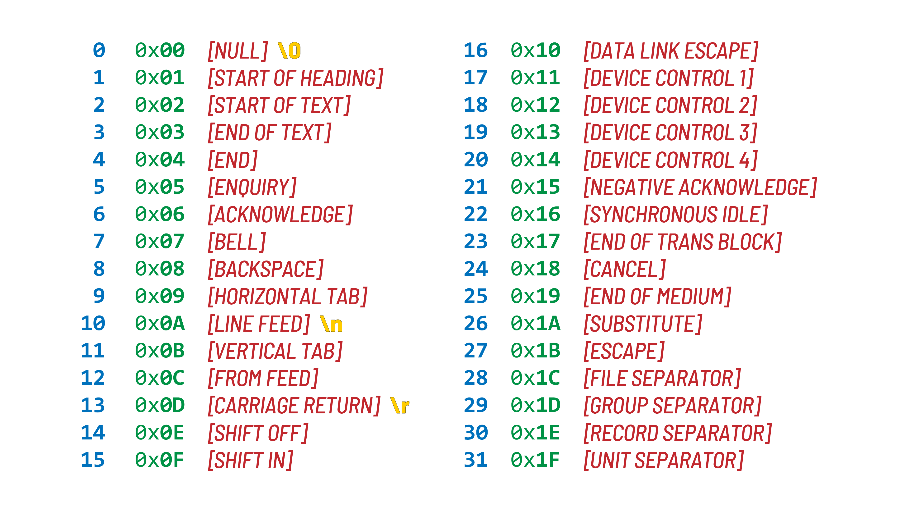
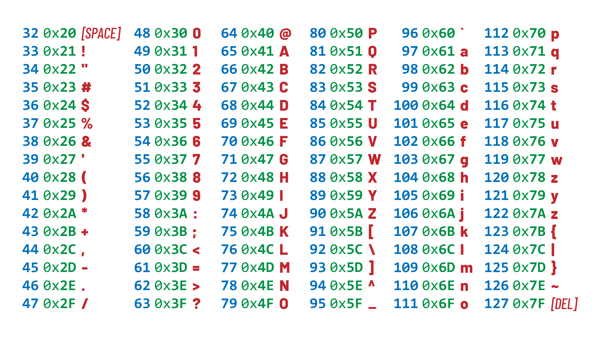
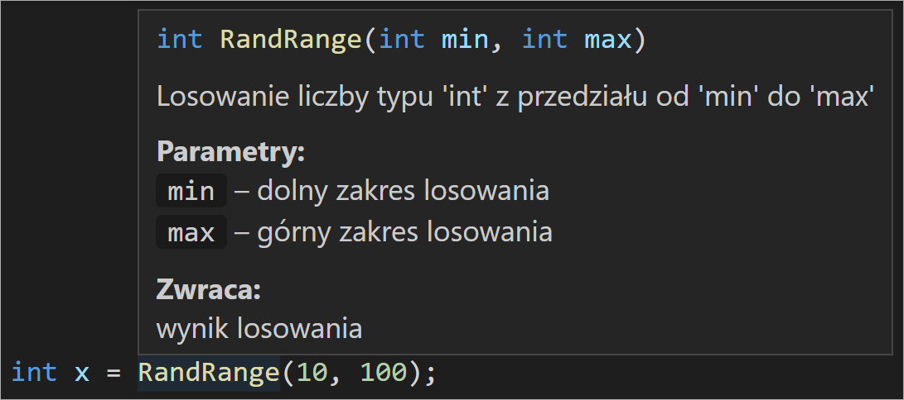

## Dlaczego C

Na języki programowania warto patrzeć jak na narzędzia. A narzędzia jak to narzędzia, często są dość uniwersalne, jednak zawsze mają określone zadanie, z którym radzą sobie dobrze. A jak jakieś narzędzie radzi sobie z czymś najlepiej ciężko, żeby znikło z skrzynki narzedziowej.

Dla języka **C** taką niszą są systemy wbudowane (embeded system)...

## Konfiguracja środowiska

Kompilowanie i debugowanie programów w języku **C** oraz innych języków kompilowanych trzeba mieć kompilator. Dla naszych zastosowań idealny będzie [**MinGW**](http://sqrt.pl/mingw.zip).

_Aby uniknąć dokonywania zmian w konfiguracji najlepiej rozpakować do lokalizacji `C:\WinGW\`_

Jest on narzędziem dzięki któremu projekt napisany w języku **C** zamienimy na plik wsadowy do mikrokontrolera `.bin`/`.hex` lub
aplikację `.exe`.


Następnym krokiem będzie dodanie ścieżki do zmiennych systemowych, tak aby skróty `gcc`, `gbd` uruchamiały odpowiedznie programy.

    {gcc-path}\mingw64\bin
    C:\WinGW\mingw64\bin


Teraz można dokonać stworzyć plik `main.c`

```cpp
#include <stdio.h> // Dołączenie biblioteki
int main (void) // Funkcja główna
{
  printf("Hello, World!"); // Wyświetlenie przywitania
  return 0;
}
```

oraz dokonać pierwszej kompilacji

    gcc {input-filse} -o {output-app}
    gcc src/main.c -o main.exe

Jednak, aby pracować wygodniej oraz debugować potrzebujemy jakiegoś IDE. Świetnie sprawdzi się [Visual Studio Code](https://code.visualstudio.com/Download) z rozszerzeniami:

- C/C++,
- Code Runner,

dla którego skonfigurowany projekt umieszczony jest w folderze `template` na tym repozytorium.

# Podstawy

## Typy zmiennych

**Typy całkowite**

| Type                                                     |  Bits | Bytes |  Znak   |    Format     |
| :------------------------------------------------------- | ----: | ----: | :-----: | :-----------: |
| `char`                                                   |     8 |     1 | `+`/`-` |     `%c`      |
| `signed char`                                            |     8 |     1 |   `-`   |     `%c`      |
| `unsigned char`                                          |     8 |     1 |   `+`   |     `%c`      |
| `short`, `short int`, `signed short`, `signed short int` |    16 |     2 |   `-`   |     `%d`      |
| `unsigned short`, `unsigned short int`                   |    16 |     2 |   `+`   |     `%u`      |
| `long`, `long int`, `signed long`, `signed long int`     |    32 |     4 |   `-`   |     `%ld`     |
| `unsigned long`, `unsigned long int`                     |    32 |     4 |   `+`   |     `%lu`     |
| `int`,                                                   | 16/32 |   2/4 |   `-`   |     `%i`      |
| `long long`, `long long int`                             |    64 |     8 |   `-`   | `%ld`/`%I64d` |
| `unsigned long long`, `unsigned long long int`           |    64 |     8 |   `+`   | `%lu`/`%I64u` |

`+`_liczba bez znaku_ `-`_liczba ze znakiem_

W zależności od kompilatora `char` oraz `int` mogą być potraktowane niejednoznacznie. Niektóre typy zmiennych mogą być określane na różne sposoby, co też jest trochę irytujące. Dodatkowo stosując `char` nie wskazujemy czy ma być on interpretowany jako 8-bitowa liczba, czy np. znak **ASCII**. Zatem dobrą praktyką jest stosować bibliotekę

```cpp
#include <stdint.h>
```

Wówczas jest porządeczek.

| Type       | Bits | Bytes |    Format     |
| :--------- | ---: | ----: | :-----------: |
| `char`     |    8 |     1 |     `%c`      |
| `int8_t`   |    8 |     1 |     `%d`      |
| `uint8_t`  |    8 |     1 |     `%u`      |
| `int16_t`  |   16 |     2 |     `%d`      |
| `uint16_t` |   16 |     2 |     `%u`      |
| `int32_t`  |   32 |     4 |     `%ld`     |
| `uint32_t` |   32 |     4 |     `%lu`     |
| `int64_t`  |   64 |     8 | `%ld`/`%I64d` |
| `int64_t`  |   64 |     8 | `%lu`/`%I64u` |

Typ `char` stosujemy jako znak lub częściej jako substytut `string`'a w przypadku tablicy lub wskaźnika, gdyż tym typem nie dysponujemy w języku `c`. Możemy dalej trzymać ten schemat dodając własne typy z subfix'em `_t`.

Brakuje również zmiennej `bool`/`boolena`, ponieważ najmniejszą ilością danych (w przypadku procesorów 8-bitowych) jaka może trafić do **ALU** jest 1 bajt, czyli zmienna typu `char`, więc tworzenie typu `bool` byłoby bezcelowe, jednak ze względu na czytelność kodu warto dołączyć bibliotekę

```cpp
#include <stdbool.h>
```

i użytać `true`/`false` zamiast `0`/`1`. Jednak jest to jedynie rzutowanie na zmienną `char`.

**Typy zmiennoprzecinkowe**

| Type          | Value bits |    Bytes | Format |
| :------------ | ---------: | -------: | :----: |
| `float`       |         23 |        4 |  `%f`  |
| `double`      |         52 |        8 | `%lf`  |
| `long double` |          - | 10/12/16 | `%LF`  |

Słabsze procesory są pozbawione hardware'owego modułu operacji dziesiętnych, więc podczas operacji na tych zmiennych są one emulowane, co jest strasznie powolne. Zatem często stosuje się zmienne całkowite z przesuniętym przecinkiem.

**Type `void`**

Ogólnie nie znaczy nic lub oznacza brak typu. Stosujemy w trzech sytuacjach:

- jako argument funkcji, która nie pobiera argumentów - `int myfnc(void)`
- oznaczenie, że funkcja nie zwraca nic - `void myfnc(int)`
- wskaźnik na nieznany typ - `void*`

## Struktura programu

Standardowa aplikacja działająca na systemie operacyjnym

```cpp
#include <stdio.h>
#include <stdint.h>
#include <stdbool.h>
// powiązania
// definicje
// zmienne globalne
int main(int argc, char *argv[]) // pobranie argumentów podczas wywołania
{
  // zmienne lokalne
  // program
  return 0;
}
```

`int argc` - ilość argumentów
`int argc` - tablica `string`-ów

Standardowa aplikacja systemów wbudowanych

```cpp
#include <stdint.h>
#include <stdbool.h>
#include "microcontroller.h"
// powiązania
// definicje
// zmienne globalne
int main(void)
{
  // zmienne lokalne
  // inicjalizacja
  while(1) {
    // runetime
  }
  return 0;
}
```

## Operatory arytmetyczne

| Nazwa              | Operator | Przykłady  | Z przypisaniem |
| ------------------ | :------: | ---------- | -------------- |
| Dodawanie          |   `+`    | x = x + y  | x += y         |
| Odejmopwanie       |   `-`    | x = x - y  | x -= y         |
| Mnożenie           |   `*`    | x = x \* y | x \*= y        |
| Dzielenie          |   `/`    | x = x / y  | x /= y         |
| Reszta z dzielenia |   `%`    | x = x % y  | x /= y         |
| Inkrementacja      |   `++`   | x++        | x += 1         |
| Dekrementacja      |   `--`   | x--        | x -= 1         |

Operatory bitowe

| Nazwa                            | Operator | Przykłady  | Z przypisaniem |
| -------------------------------- | :------: | ---------- | -------------- |
| Koniunkcja **AND**               |   `&`    | x = x & y  | x &= y         |
| Alternatywa **OR**               |   `\|`   | x = x \| y | x \|= y        |
| Alternatywa wykluczająca **XOR** |   `^`    | x = x ^ y  | x ^= y         |
| Negacja **NOT**                  |   `~`    | x = ~x     |                |
| Przesunięcie w lewo              |   `<<`   | x = x << y | x <<= y        |
| Przesunięcie w prawo             |   `>>`   | x = x >> y | x >>= y        |

```cpp
  int16_t a = 12;
  int16_t b = 4;
  a = a + b; //
```

## Switch...Case

W przykładzie w zależności od zmiennej `day` ma wyświetlić się nazwa dnia tygodnia, na który wskazuje.

```cpp
int day = 4;
switch(day)
{
  case 1: printf("Dziś jest poniedziałek"); break;
  case 2: printf("Dziś jest wtorek"); break;
  case 3: printf("Dziś jest środa"); break;
  case 4: printf("Dziś jest czwartek"); break;
  case 5: printf("Dziś jest piątek"); break;
  case 6: printf("Dziś jest sobota"); break;
  case 0: case 7: printf("Dziś jest niedziela"); break;
}
```

Widzimy, że po każdym bloku kodu dla każdej opcji znajduje się instrukcji `break`. Instrukcja to wymusza wyjście z instrukcji `switch`, a także pętki takich jak `while`, czy `for`. Instrukcję `break` możemy pominąć, wówczas program przeskoczy do kolejnego `case`-a

```c#
uint8_t day = 4;
switch (day)
{
  case 1: printf("Do weekendy jeszcze trzeba przeżyć poniedziałek\n");
  case 2: printf("Do weekendy jeszcze trzeba przeżyć wtorek\n");
  case 3: printf("Do weekendy jeszcze trzeba przeżyć środę\n");
  case 4: printf("Do weekendy jeszcze trzeba przeżyć czwartek\n");
  case 5: printf("Do weekendy jeszcze trzeba przeżyć piątek");
    break;
  default:
    printf("Weekend trwa w najlepsze!");
    break;
}
```

## Enum/Define

Typy wyliczeniowe `enum` i definicje `define`

```c#
enum weekDay {
  WEEKDAY_Monday = 1,
  WEEKDAY_Tuesday = 2,
  WEEKDAY_Wednesday = 3,
  WEEKDAY_Thursday = 4,
  WEEKDAY_Friday = 5,
  WEEKDAY_Saturday = 6,
  WEEKDAY_Sunday = 7
};

enum weekDay day = WEEKDAY_Thursday;
```

```c#
enum weekDay {
  WEEKDAY_Monday = 1,
  WEEKDAY_Tuesday = 2,
  WEEKDAY_Wednesday = 3,
  WEEKDAY_Thursday = 4,
  WEEKDAY_Friday = 5,
  WEEKDAY_Saturday = 6,
  WEEKDAY_Sunday = 7
} day = WEEKDAY_Thursday;
```

```c#
typedef enum {
  WEEKDAY_Monday = 1,
  WEEKDAY_Tuesday = 2,
  WEEKDAY_Wednesday = 3,
  WEEKDAY_Thursday = 4,
  WEEKDAY_Friday = 5,
  WEEKDAY_Saturday = 6,
  WEEKDAY_Sunday = 7
} weekDay_t;

weekDay_t day = WEEKDAY_Thursday;
```

Typy wyliczeniowe stożone za pomocą słowa `enum` mają wielkość `int`. Gdy chcemy zaoszczędzić pamięć, możemy zmienić `_t` na `_e` oraz przypisywać jego wartości do zmiennych zajmujących mniej pamięci w celu optymalizacji.

```c#
typedef enum {
  WEEKDAY_Monday = 1,
  WEEKDAY_Tuesday = 2,
  WEEKDAY_Wednesday = 3,
  WEEKDAY_Thursday = 4,
  WEEKDAY_Friday = 5,
  WEEKDAY_Saturday = 6,
  WEEKDAY_Sunday = 7
} weekDay_e;

uint8_t day = WEEKDAY_Thursday;
```

Możemy też po prostu użyć `#define`. Przyjmuje się, że definicje składają się z dużych liter.

```c#
#define WEEKDAY_MONDAY = 1,
#define WEEKDAY_TUESDAY  = 2,
#define WEEKDAY_WEDNESDAY = 3,
#define WEEKDAY_THURSDAY = 4,
#define WEEKDAY_FRIDAY = 5,
#define WEEKDAY_SATURDAY = 6,
#define WEEKDAY_SUNDAY = 7

uint8_t day = WEEKDAY_THURSDAY;
```

## Functions

...

## If...Else

Operatory logiczne

| Nazwa          | Operator | Przykłady |
| -------------- | :------: | --------- |
| Równy          |   `==`   | x == y    |
| Różny          |   `!=`   | x != y    |
| Większy        |   `>`    | x > y     |
| Mniejszy       |   `<`    | x < y     |
| Większy-Równy  |   `>=`   | x >= y    |
| Mniejszy-Równy |   `<=`   | x <= y    |

```cpp
int32_t a = 12, b = 16;

if(a == b) {
  printf("Result: %d = %d", a, b);
}
else if (a > b) {
  printf("Result: %d > %d", a, b);
}
else {
  printf("Result: %d < %d", a, b);
}
```

Gdy obsługą instrukcji warunkowej jest pojedyncza pętla to możemy pominąć nawiasy `{}`

```cpp
int32_t a = 12, b = 16;

if(a == b) printf("Result: %d = %d", a, b);
else if (a > b) printf("Result: %d > %d", a, b);
else printf("Result: %d < %d", a, b);
```

Operatory logiczne dla prawdy zwracają `1` natomiast dla fałszu `0`.
Podczas implementacji `0` jest traktowane jako fałsz, a każda inna wartość jako prawda.

```cpp
uint8_t error_code = 23;
if(error_code) printf("Error: %i", error_code);
```

W wnętrzu `if` możemy umieszczać wywołania funkcji

```cpp
uint8_t error_code;
if(error_code = connection())  printf("No connection!");
```

Łączenie wyrażeń logicznych

| Nazwa                       | Operator | Przykłady              | Rezultat       |
| --------------------------- | :------: | ---------------------- | -------------- |
| Suma logiczna **AND**       |   `&&`   | `x > 2 && x <= 5`      | x ∈ ( 2 ; 5 〉 |
| Alternatywa logiczna **OR** |  `\|\|`  | `x <= 2 \|\| x > 5`    | x ∈ ( 2 ; 5 〉 |
| Negacja logiczna **NOT**    |   `!`    | `!(x > 2 \|\| x <= 5)` | x ∈ ( 2 ; 5 〉 |

```cpp
int32_t age = 12;

if(age < 14 || age > 40) printf("Good Morning");
else if (age < 28) printf("Hello");
else printf("Hi");
```

<!---
TODO: Example value - buffer, error
-->

## Loops

...

## Pointers

Deklaracja i wywołanie:

```cpp
int var; // deklaracja zmiennej
int *p; // deklaracja wskaźnika
var; // wartość
&var; // adres gdzie znajduje się wartość
p // wskaźnik na adres pamięci
*p; // wartość, na którą wskazuje wskaźnik,
```

```cpp
int nbr = 64;
printf("Value: %d\r\n", nbr); // wartość
printf("Adrress: %p\r\n", &nbr);
// adres gdzie znajduje się wartość
```

```cpp
int nbr = 64;
unt *p = &nbr; // ustawienie wskaźnika
printf("Value: %d\n", *p);
// wartość, na którą wskazuje wskaźnik,
printf("Adrress: %p\n", &p);
// wskaźnik na adres pamięci
```

## Arrays

Deklaracja tablicy

```cpp
uint8_t ary[4]; // OK
uint8_t ary[]; // ERR
uint8_t ary[4] = {1, 2, 4, 8}; // OK
uint8_t ary[] = {1, 2, 4, 8}; // OK
```

|    index     |    [0]     |    [1]     |    [2]     |    [3]     |
| :----------: | :--------: | :--------: | :--------: | :--------: |
| value `addr` | 1 `0xFF01` | 2 `0xFF02` | 4 `0xFF03` | 8 `0xFF04` |

Deklaracja tablicy 2D

```cpp
uint8_t ary2d[2][2] = {1, 2, 4, 8}; // OK
uint8_t ary2d[2][2] = {{1, 2}, {4, 8}}; // OK
uint8_t ary2d[][2] = {1, 2, 4, 8}; // OK
uint8_t ary2d[][] = {1, 2, 4, 8}; // ERR
uint8_t ary2d[2][] = {1, 2, 4, 8}; // ERR
```

| m↓ n→ |    [0]     |    [1]     |
| :---: | :--------: | :--------: |
|  [0]  | 1 `0xFF01` | 2 `0xFF02` |
|  [1]  | 4 `0xFF03` | 8 `0xFF04` |

```cpp
char ary2d[m][n]
```

**Arrays & Pointers**

```cpp
uint8_t ary[] = {1, 2, 4, 8};
uint8_t ary2d[2][2] = {{1, 2}, {4, 8}};
uint8_t *p = ary;
uint8_t *p2d = ary2d;
```

`p` → wskaźnik
`ary` → referencja (statyczna referencja)

`*p` = `*p2d` = `p[0]` = `ary[0]` = `ary2d[0][0]`= `ary2d[0]` = `1`

`*(p+1)` = `*(p2d+1)` = `p[1]` = `ary[1]` = `ary2d[0][1]`= `ary2d[1]` = `2`

`*(p+2)` = `*(p2d+2)` = `p[2]` = `ary[2]` = `ary2d[1][0]`= `ary2d[2]` = `4`

`*(p+3)` = `*(p2d+3)` = `p[3]` = `ary[3]` = `ary2d[1][1]`= `ary2d[3]` = `8`

## Strings

Wszystkie poniższe deklaracje dotyczą tego samego łańcucha znaków `Hello`

```cpp
char str1[100] = "Hello\0";
char str2[] = "Hello";
char str3[6] = { 'H','e','l','l','o', '\0' };
char str4[] = { 'H','e','l','l','o', 0 };
char str5[] = { 72,101,108,108,111,0 };
char str6[] = { 0x48,0x65,0x6C,0x6C,0x6F,0x00 };
```

Powiązanie pomiędzy liczbą a znakiem znajdziemy w tablicy **ASCII**.
String jest **wskaźnikiem**/**referencją**, który wskazuje na rejestr zawierający pierwszy znak łańcucha. Łańcuch ciągnie się do rejestru, w którym znajduje się wartość `0`.

| str  |   'H'    |   'e'    |   'l'    |   'l'    |   'o'    |    0     |
| :--: | :------: | :------: | :------: | :------: | :------: | :------: |
| addr | `0xFF01` | `0xFF02` | `0xFF03` | `0xFF04` | `0xFF05` | `0xFF06` |

Wyświetlanie stringów i znaków

```cpp
printf("%s\n", str); // Hello
printf("%c\n", str[0]); // H
printf("%u\n", str[0]); // 72
printf("0x%x\n", str[0]); // 0x48
```

```cpp
printf("%c\n", *str); // H
printf("%c\n", str[2]); // l
printf("%s\n", str + 2); // llo
printf("%c\n", *(str + 2)); // l
printf("%s\n", &str[2]); // llo
```

Znaki w łańcuchu odpowiadają odpowiednim liczbą `uint8_t` - przynajmniej dla kodowania **utf-8**.



Wartości do `0x1F` zawierają znaki niedrukowane spośród, których najważniejsze są:

- `\0` - Koniec stringa
- `\r\n`, `\n`, `\r` - nowa linia w zależności od systemu

Wartości do `0x7F` zawierają stały zestaw znaków



A potem jest różnie w zależności od kodowania

## Program `ArraySum`

Funkcja obliczająca **sum**ę elementów znajdujących się w tablicy:

```cpp
int ArraySum(int ary[], uint16_t length)
{
  int sum = 0;
  for(int i = 0; i < length; i++) {
    sum += ary[i];
  }
  return sum;
}
```

Declarations & **Execut**:

```cpp
#define LEN 6
//...
int main_ary[LEN] = { 1, 2, 3, 4, 5, 6};
int sum = ArraySum(main_ary, LEN);
printf("Suma: %i", sum);
```

W przypadku powiązanych z sobą wartości, które powtarzają się kilkukrotnie w kodzie, warto użyć definicji `#define`

**Console** Output:

    Suma: 21

Realizacja tej samej funkcji z użyciem wskaźników:

```cpp
int ArraySum(int *ary, uint16_t length)
{
  int sum = 0;
  while(length) {
    sum += *ary;
    length--;
    ary++;
  }
  return sum;
}
```

## Program `CaesarCode`

Funkcja kodująca wielkie litery danego łańcucha znaków `char *str` za pomocą kodu cezara przesunięciem `int8_t offset`:

```cpp
#define RANGE 'Z' - 'A'
void CaesarCode_Print(char *str, int8_t offset)
{
  offset %= RANGE;
  while(*str) {
    char sign = *str;
    if(sign >= 'A' && sign <= 'Z') {
      sign += offset;
      if(sign > 'Z') { sign -= RANGE; }
      else if(sign < 'A') { sign += RANGE; }
    }
    printf("%c", sign);
    str++;
  }
}
```

Declarations & **Execut**:

```cpp
char *main_str = "#HeLLo-7WoRLd";
CaesarCode_Print(main_str, 3);
```

**Console** Output:

    #KeOOo-7ZoUOd

## Alokacja pamięci

Zajmowanie i zwalnianie pamięci

```cpp
#include <stdlib.h>
//...
size_t size = 32;
uint32_t *buffer = malloc(size * sizeof(uint32_t)); // zarezerwowanie  128 byte'ów pamięci
//...
free(buffer); // zwolnienie pamięci
```

## Structures

Deklaracja konstruktora i zmiennej

```cpp
// konstruktor
struct Point {
  int32_t x;
  int32_t y;
};

// deklaracja zmiennej
struct Point point; // brak inicjalizacji
struct Point point = { 5, 2 };
struct Point point = { .x = 5, .y = 2 };
struct Point point = { .y = 2, .y = 5 };
```

```cpp
// konstruktor
typedef struct {
  int32_t x;
  int32_t y;
} point_t;

// deklaracja
point_t point; // brak inicjalizacji
point_t point = { 5, 2 };
point_t point = { .x = 5, .y = 2 };
point_t point = { .y = 2, .y = 5 };
```

Wywołanie

```cpp
struct point point;
point.x = 3; // ustawienie współrzędnej `x` gdy mamy strukturę

struct point *p = &point; // wskaźnik na strukturę
(*p).x = 3; // ustawienie współrzędnej `x` gdy mamy wskaźnik na strukturę
p->x = 3; // ale lepiej tak
```

## Opisy funkcji

```cpp
/**
 * Losowanie liczby typu `int` z przedziału od `min` do `max`.
 * @param min dolny zakres losowania.
 * @param max górny zakres losowania.
 * @return wynik losowania.
 */
int RandRange(int min,  int max) {
  return min + rand() % (max - min + 1);
}
```
Stosując powyższy schemat tworząc funkcję uzyskamy przydatną podpowiedź



## Pseudoklasa `vector`

Krok **1**: Funkcja `FillArray32MinMax`

```cpp
/**
 * Funkcja wypełnia przekazaną tablice 'array' wartościami od 'min' do 'max' co '1'.
 * @param array zadeklarowana tablica.
 * @param min wartość, od której zaczyna wypełniać się tablica.
 * @param min wartość,  na której kończy wypełniać się tablica.
 * @param limit długość zadeklarowanej tablicy.
 * @retval liczba elementów, którymi została wypełniona tablica.
 * Zwraca '0' jeżeli limit < abs(max - min).
 */
uint16_t FillArray32MinMax(int32_t array[], int32_t min, int32_t max, uint16_t limit)
{
  uint16_t i = 0;
  while(min != max) {
    if(max > min) array[i++] = min++;
    else array[i++] = min--;
    if(!--limit) return 0;
  };
  array[i++] = min;
  return i;
}

//...

#define ARRAY_LENGTH 16
int main(void)
{
  int32_t array[ARRAY_LENGTH];
  uint16_t length = FillArray32MinMax(array, -5, 10, ARRAY_LENGTH);

  if(length) {
    for(int i = 0; i < length; i++) printf("%d ", array[i]);
  }
  else printf("error");
  return 0;
}
```

Krok **2**: Funkcja `GetArray32MinMax`

```cpp
/**
 * Funkcja tworzy tablicę 'array' i wypełnia ją wartościami od 'min' do 'max' co '1'. 
 * @param array wskaźnik na niezadeklarowaną tablicę
 * @param min wartość, od której zaczyna wypełniać się tablica.
 * @param min wartość, na której kończy wypełniać się tablica.
 * @retval długość zwróconej tablicy.
 */
uint16_t GetArray32MinMax(int32_t *array[], int32_t min, int32_t max)
{
  uint16_t length;
  if(max > min) length = (uint16_t)(max - min + 1);
  else length = (uint16_t)(min - max + 1);

  *array = (int32_t *)malloc(length * sizeof(int32_t));
  return FillArray32MinMax(*array, min, max, length);
}

//...

int main(void)
{
  int32_t *array;
  uint16_t length = GetArray32MinMax(&array, -5, 10);

  if(length) {
    for(int i = 0; i < length; i++) printf("%d ", array[i]);
  }
  else printf("error");
  return 0;
}
```

Krok **3**: Pseudoklasa `vector`

```cpp
/**
 * Wektor typu uint32_t
 * @param buffer wskaźnik na zawartość wektora
 * @param length długość wektora
 */
typedef struct vectorType {
  int32_t *buffer;
  uint16_t length;
} vector_t;

/**
 * Funkcja tworzy wektor 'vector_t' i wypełnia go wartościami od 'min' do 'max' co '1'.
 * @param min wartość, od której zaczyna wypełniać się tablica.
 * @param min wartość, na której kończy wypełniać się tablica.
 * @retval wektor 'vector_t'.
 */
vector_t vectorInit(int32_t min, int32_t max)
{
  vector_t vector;
  vector.length = GetArray32MinMax(&vector.buffer, min, max);
  return vector;
}

/**
 * Funkcja sprawdza, czy wektor jest zainicjowany.
 * @param vector wskaźnika na wektor 'vector_t'.
 * @retval true: wektor zainicjowany, false: wektor niezainicjowany.
 */
bool vectorIsSet(vector_t *vector)
{
  if(vector->length) return true;
  else false;
}

//...

int main(void)
{
  vector_t vector = vectorInit(5, 20);
  
  if(vectorIsSet(&vector)) {
    for(int i = 0; i < vector.length; i++) printf("%d ", vector.buffer[i]);
  }
  else printf("error");
  return 0;
}
```

## Tworzenie i wysyłanie bufora

Gdy przejdziemy z zabawy językiem `c` na komputerach do niskopoziomowych implementacji będziemy pozbawienie funkcji `printf`. Będziemy w pętli albo w przerwaniu realizowani wpisanie danej do odpowiedniego rejestru lub konfigurowali **DMA**, a hardware zajmie się wysłaniem danych. Z odebranymi danymi możemy zrobić, co chcemy. Również po prostu wyświetlić.

Jednym z rozwiązań jest umieszczanie danych w buforze i stosowanie wskaźników `head` i `tail`. `head` zwiększa się, gdy dodajemy dane do bufora, natomiast `tail` gdy je wysyłamy. Gdy wskaźniki są sobie równe, nie ma danych do wysłania. 

Struktura bufora

```cpp
typedef struct {
  const char *name;
  uint16_t head;
  uint16_t tail;
  uint8_t *buffer;
  uint16_t length;
} BUFF_t;
```

Inicjacja bufora

```cpp
const char name[] = "x";
uint8_t array[64];
BUFF_t buff = { .name = name, .buffer = array, .length = sizeof(x_array) };
```

Funkcje dodania i wysłania danych

```cpp
void BUFF_Push(BUFF_t *buff, uint8_t *buffer, uint16_t length)
{
  while (length--) {
    buff->buffer[buff->head++] = *buffer;
    buffer++;
    if(buff->head >= buff->length) buff->head = 0;
  }
}

bool BUFF_Send(BUFF_t *buff)
{
  if(buff->head != buff->tail) {
    printf("%s:%i ", buff->name, buff->buffer[buff->tail++]);
    // REG = buff->buffer[buff->tail++]; // for embedded systems
    if(buff->tail >= buff->length) buff->tail = 0;
    return true;
  } else return false;
}
```

Dodanie danych do bufora i ich wysłanie

```cpp
int main(void)
{
  uint32_t a = 0x01020304;
  BUFF_Push(&buff, (uint8_t *)&a, sizeof(uint32_t));
  while(BUFF_Send(&buff));
}
```

Struktura `BUFF_t` oraz funkcję `BUFF_Push`, `BUFF_Send` tworzą pseudoklasę.

<!--

liczy pierwsze i listy
uint16_t vector sin to uint8_t
Macieże operacje
Własne objekty

Czytanie plików??

-->

<!---

const

komentaże

```cpp


for(int i;

```

//scanf("%d %d", &number1, &number2);

```cpp
void read()
{
   char str[20];
   gets(str);
   printf("%s", str);
   return;
}
```

```cpp
#define MAX_LIMIT 20
void read()
{
   char str[MAX_LIMIT];
   fgets(str, MAX_LIMIT, stdin);
   printf("%s", str);

   getchar();
   return;
}
```

// protobuff
// struktura danych littel-endin

// napisz funkcje

Operatory logiczne

Operatory binarne

// nagłówki .h -> para .c .h
// multifile program

```cpp
#include <stdio.h>
int main()
{
   char str[20];
   gets(str);
   printf("%s", str);
   return 0;
}
```

## Struktury

## Wskaźniki

## Rzutowanie

// słabe typowanie

// komentarze

// chamskie konwersjie
// size_of

//%c %d

```cpp
int i, j, k; //
char c, ch; //
float f, price; //
double d; //
void
```

```cpp
int i, j, k; //
char c, ch; //
float f, price; //
double d; //
void
```

### Biblioteka

```cpp
#include <stdbool.h>
#include <stdint.h>
```

`Variable`

Zmienne C

extern int d = 3, f = 5; // declaration of d and f.
int d = 3, f = 5; // definition and initializing d and f.
byte z = 22; // definition and initializes z.
char x = 'x'; // the variable x has the value 'x'.

Zmienne języka C

int i, j, k;
char c, ch;
float f, salary;
double d;
void

```cpp
#include <stdio.h>
int main (void)
{
  puts ("Hello World!");
  return 0;
}
```


# Rust

Na następce języka c powoli wyrasta rust, ale ciężko powiedziać jak to bedzie dalej wyglądało. Obecnie jest on mało popularny, gdyż jest mało pododów rynkowych, żeby zmieniać 


RUST jest systemowym językiem programowania. Reklamowany jest jako język szybki, zapobiegający naruszeniom pamięci, oraz jako język, który umożliwia bezpieczne operowanie wątkami


https://www.rust-lang.org/tools/install

Rust Extension Pack

Rust
Better TOML
crates


https://visualstudio.microsoft.com/thank-you-downloading-visual-studio/?sku=BuildTools&rel=16

-->